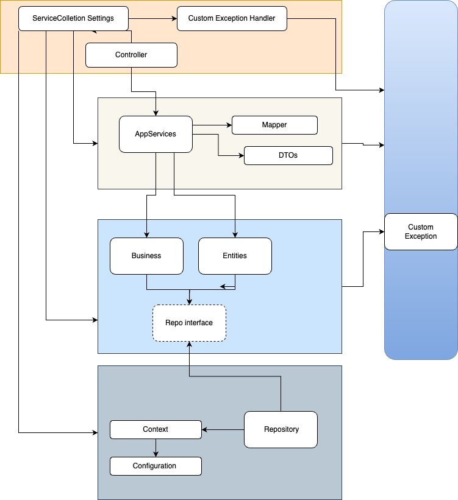

# Mindera Challenge : Fixing Blog Application

## Getting it to run

This application depends on the existence of a Blog DB and two tables : Post and Comment.
Before running the app, make sure that the Database is running and the `appsettings.json` contains a connection string point to the correct server.

For Running the DB please execute docker-compose command :

```
docker-compose up -d 
```
Once command ran DB and Tables will be in place and ready for usage. 

If you need to stop and remove the MSSQL Container, execute :
```
docker-compose down 
```


### Database Details

The DB is being set by the `Docker-Compose.yml` file. Please, for running it locally and correct mount of Connection string on appsettings.json on  API project, look into the Docker-Compose.yml pre-set configuration.  

#### Dependency :
 To get the DB running, make sure that `mssql` folder contains `1-SetupStructure.sql` and `init-db.sh`. Those two files are needed in order to craete the Database. 


### API

#### With Docker : 
 - Execute the docker build command ` docker build -t blog.api:1.0 . ` 
 - Execute the docker run command `docker run -p 5500:80 blog.api:1.0`


 Now you have access to the API's on `localhost:5500/posts` or `localhost:5500/comments`

## Arch

Following the N-Layer architecture approache to solve the Mindera code assessment.
this project structure contains four different layers with single responsiblities and shares interfaces to communicate and execute functions adequately. 

The API, AppServices and Models layers also contains test projects associated with the respective layers. You can find the test projects in the same folder as each layer.

### Diagram



### Layer's Responsabilities 

API responsabilities:
- Expose the APIs for Post and Comment 
- Call App Service Layer 
- Evalaute the response and set the correct HttpStatus
- Configure ExceptionFilter to catch generic exceptions
- Configure appsettings to set the SQL 

App Services responsabilities:
- Gateway on API and Domain's  Business interface
- Handle Maps from DTO to Domain and vise-versa
- Defines DTOs for response

Domain responsabilities:
- Keep Domain entities
- Define and execute BusinessRules
- Keep interface for Reposistory serives

Repository responsabilities:
- Configure DB vis EntityFramework
- Implement Domain Repository interfaces


## Tech Descisions and Challenges

- Decided to add App Service and CrossCutting layers to handle specific tasks
- Turned code into Async
- Using real DB connection
- Added Dockerfile and docker compose
- Added Swagger

## Enhancements / Improvements

Pending actions are related to lack of time to get it all done

- Could improve Code Coverage 
- Add Make 
- Refactoring Application and Business layer code to avoid repting code/bahaivour.
- Add Integration Test
- Swagger Doc improvement.
- Add Cancelation Token
- Add HATEOAS to action responses.
- Improve Logs


#### Using VS For Mac.
Some project names was messed up when I tried o move things around to make more sence in terms of Folder organization. You may see one or other not matching the naming approach, but still, tried to fix it all and make more compatible as possible. 


### Final Thoughts

It was a good challenge, seems simple at first but it can take alot of our time when drilling into N-Layer approach ;)